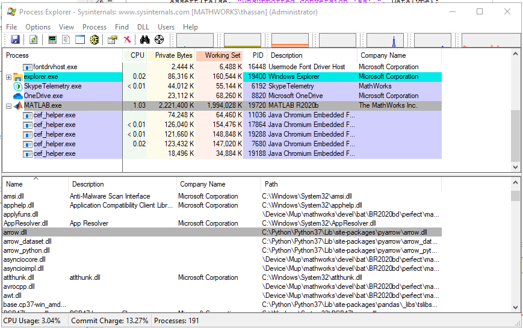

## Issue Description:

In future, we would like to tightly integrate MATLAB and pyarrow communication.

The users may bring the python libraries using in-process or [out-of-process] [execution mode] <br>
Currently, we are seeing with in-process execution mode, the user is having library clashes from `arrow.dll` in Windows, _but not on_ Mac (yet?). 

Here is the workflow and code to demonstrate the issue:
* The user brings `pyarrow` package using in-process execution mode to perform some `python/pyarrow` related work.
* The user then calls [parquetinfo], which is a MATLAB function that uses `arrow.dll`. 

```matlab
>> pe = pyenv( "Version", "C:\\Python\\Python37\\python.exe", "ExecutionMode", "InProcess");

>> %%                   POINT A - loading pyarrow, which also loads its own version of arrow.dll 
>> A = py.readNestedParquet.readNestedPq("ExampleData/ExampleA.parquet")

A = Python dict with no properties.

{'var1': \[1277596818000000000, 1277596878000000000, 1277596938000000000\],
'col\_fail': \[\[\[0.0\], \[0.0\], \[0.0\]\] ],
'col\_success': \[0.0, 0.0, 0.0]}

>> %%                   POINT B - loading arrow, shipped with MATLAB
>> pqInfo = parquetinfo("ExampleData/ExampleA.parquet")
```
Now, since the user first loaded pyarrow inside MATLAB, which ended up loading `arrow.dll`, 
but a different version/symbol than what `parquetinfo` (MATLAB function) expects we get the following error : 


```diff
- Unable to load bundle binary D:\\...\\matlab\\bin\\win64\\builtins\\matlab\_toolbox\_parquetio\\mwlibmwparquetio\_builtinimpl.dll. 
- Error: 127: state not recoverable
```
pyarrow is internally built on top of libarrow.so using _version 3.0.0_ of the CPP library ?.

[parquetinfo] is internally built on top of libarrow.so using _version 0.12.0_ of the CPP library.


### What is happening in Windows :
In Windows, you can use [Process Explorer] to see which dll was loaded during different points.

Note, in Windows both pyarrow and Windows versions of the dll are named "`arrow.dll`".
````
C:\\Python\\Python37\\Lib\\site-packages\\pyarrow\\arrow.dll -> pyarrow shipped arrow
D:\\...\\matlab\\bin\\win64\\arrow.dll. -> MATLAB shipped arrow
````

In Windows, since MATLAB process has already loaded `arrow.dll` once (from point A in the previous code sample, due to calling `pyarrow`), 
it will not go ahead and load the MATLAB shipped `arrow.dll` (from point B in the previous code sample)



### What is happening in Mac :
Luckily, in Mac machines the MATLAB shipped dylib version is different from the `pyarrow` shipped dylib version:
````
/usr/local/lib/python3.8/site-packages/pyarrow/libarrow.300.dylib  -> pyarrow shipped arrow
matlab/bin/maci64/libarrow.12.1.0.dylib -> MATLAB shipped arrow
````
So, we are luckily not running into the same issues. We can verify this using `lsof` command. We saw that both libarrow (from `pyarrow` and MATLAB were ultimately loaded into MATLAB application).

  

## Overview of Proposed Solution :

### Library name change 
  
The first part of the change we propose is to rename our version of `libarrow.so/arrow.dll` to `libmwarrow.so/libmwarrow.dll`.
Let's take the in-process python/pyarrow workflow.

*   The user first starts a python process  [Python process in MATLAB]
*   The user calls on `pyarrow` module. [How to load a python module in MATLAB].  This loads `libarrow.so`, which is the vanilla `libarrow` with "`namespace arrow`" 
*   Now the user calls `parquetinfo` from MATLAB 
    *   MATLAB process, will load our shipped `libmwarrow.dll `

However, this library name change needs to be performed at the build level. This is not as simple as just renaming the user visible lib name, e.g. <br>
`mv arrow.dll libmwarrow.dll` 
<br>
will not work. 

We need to change the name, that the linker would be look at. When the linker is loading the dll, it's really looking at the internal name. 
In Linux, this would be `SONAME`. 
For details, please look here : https://www.programmersought.com/article/3694626819/

Given, Arrow uses CMake, we are hoping that we could leverage some cmake mechanism <br>
e.g. `set_target_properties LIBRARY_OUTPUT_NAME` or setting `ARROW_SO_VERSION` to achieve this? <br>
```diff
- We are trying to get some feedback regarding whether there is a preferred way to do library renaming from arrow dev mailing list.
````

### Isolate Arrow interface
However, changing the library name is only a part of the solution. We also need to isolate the arrow interface. 
When MATLAB's code calls `libmwarrow.dll`, the same symbol might still be loaded by `arrow.dll` from `pyarrow` in Windows.
Which symbol gets loaded, when, depends on the workflow, platform, compiler etc. <br>
This bit is especially tricky in Windows. <br>
MATLAB code should really be calling the symbol we ship __ONLY__<br>

So, the second part of this change is to add a namespace around the library.
Since the library we are working with is a C++ library, we can get away with using a custom namespace.

* `arrow` -> `mwarrow`
* `parquet` -> `mwparquet`
* So on and so forth. 

This way, if the pyarrow brings it's own `libarrow` of a different version, it can look for symbols inside `namespace arrow`; whereas MATLAB functions can look for `namespace mwarrow` functionality. This will work, even if MATLAB/`pyarrow` brings in different versions/patches of `libarrow`. 

### Isolate Arrow implementation
However, namespacing of exported headers will not be enough. 

C++ ODR violations can occur with classes, template and inline code, not just functions imported from the shared library; <br>
the runtime linker (I think this is true for almost all compilers/platforms) will *merge symbols* with the same fully-qualified name. <br>
**even if there was no compile or link time dependency between files​**

This essentially means, if there is some code in `arrow` e.g. <br>
`arrow::status` it needs to be changed to `mwarrow::status` <br>

```diff
- We are trying to get some feedback regarding whether there is a preferred way to do library renaming from arrow dev mailing list.
````
Worst case, we might have to write a [Clang tidy custom matcher] to do this.


<!-- Links -->
[out-of-process]: https://www.mathworks.com/help/matlab/matlab_external/out-of-process-execution-of-python-functionality.html
[execution mode]: https://www.mathworks.com/help/matlab/ref/pyenv.html#d122e1032322
[parquetinfo]: https://www.mathworks.com/help/matlab/ref/matlab.io.parquet.parquetinfo.html
[Python process in MATLAB]: https://www.mathworks.com/help/matlab/matlab_external/create-object-from-python-class.html
[Process Explorer]: https://docs.microsoft.com/en-us/sysinternals/downloads/process-explorer
[Clang tidy custom matcher]: https://blog.audio-tk.com/2018/03/20/writing-custom-checks-for-clang-tidy/
[How to load a python module in MATLAB]: https://www.mathworks.com/help/matlab/call-python-libraries.html
